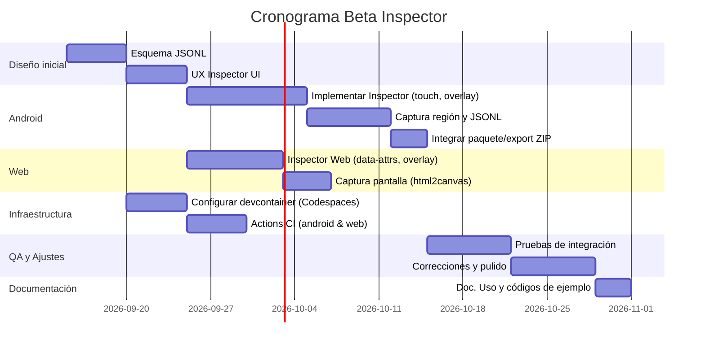

# Resumen Ejecutivo  
Para implementar un **Beta Inspector** local (Android Compose + Next.js) y un entorno de desarrollo basado en Codespaces/Linux, proponemos un esquema de reporte JSONL detallado, estrategias de captura de pantalla específicas, APIs de Compose para inspección, un inspector web con html2canvas, empaquetado de reportes, configuración exacta de `.devcontainer` y flujos de trabajo de GitHub Actions. También se definen políticas de seguridad/redacción y un cronograma con tareas, horas estimadas y criterios de aceptación. Se incluyen ejemplos de código (Kotlin/Compose y JavaScript), tablas comparativas (métodos de captura de pantalla, opciones de almacenamiento, tamaños de máquina de Codespaces) y un diagrama de Gantt en Mermaid.  

## Esquema JSONL para reportes UI  
El formato **JSON Lines (JSONL)** requiere que cada línea sea un objeto JSON independiente. Se almacenará un registro por línea con campos como:
- `timestamp` (fecha-hora del evento), `screen` (pantalla o ruta en la app/web), `elementId` (identificador de UI, p.ej. recurso Compose o selector web), `issueType` (tipo de problema: «layout», «imagen», «texto», etc.), `description` (descripción breve), `screenshotFile` (nombre de imagen asociada), y `metadata` adicional (usuario, versión app, etc.).  
- Ejemplo de línea JSONL:  
```json
{"timestamp":"2026-09-14T10:15:00","screen":"MainActivity","elementId":"productCard_23","issueType":"layout","description":"Texto cortado en tarjeta de producto","screenshotFile":"screenshot_20260914_101500.png","metadata":{"user":"test1","version":"1.2.3-beta"}}
```  
Se guardará con extensión `.jsonl` (o `.jsonl.gz` comprimido), y al final de cada línea incluir un salto de línea.  

**Rotación/Límites:** Se puede hacer rotación diaria o por tamaño (p.ej. 1 MB). Por ejemplo, crear un nuevo archivo diario o si supera X MB, renombrar el antiguo y empezar uno nuevo. Mantener una cantidad limitada de archivos históricos (p.ej. 7 días) eliminando o comprimiendo los más viejos.  

**Privacidad/Redacción:** El reporte no debe incluir datos sensibles (PII, tokens, contraseñas). Siguiendo las guías de Android, **no registrar información privada** en producción. Se debe enmascarar o omitir cualquier dato confidencial (por ejemplo usar IDs internos o tokens genéricos en lugar de valores reales).  

**Ubicación:** Guardar los archivos JSONL en almacenamiento interno privado de la app (`context.filesDir`). Allí solo la app puede acceder y se borra al desinstalarla. Por ejemplo: `val file = File(context.filesDir, "issues.jsonl")`. Esto asegura que el usuario (o atacantes) no vean los logs.  

## Captura de pantalla en Android  
Para capturar la región exacta de un elemento UI en Android Compose, se manejan dos retos: obtener la imagen bitmap y seleccionar la zona. Dos métodos populares:  

- **LocalView + Canvas:** Obtener `LocalView.current` dentro de un Composable, crear un `Bitmap` del tamaño de la vista y dibujarla. Ejemplo:  
  ```kotlin
    val view = LocalView.current
      val bmp = Bitmap.createBitmap(view.width, view.height, Bitmap.Config.ARGB_8888).applyCanvas { view.draw(this) }
        ```
          Esto captura toda la vista actual. Luego se puede recortar el bitmap al área del elemento usando coordenadas globales obtenidas con `Modifier.onGloballyPositioned`. Es relativamente sencillo pero captura todo el contenedor padre por defecto.  

          - **PixelCopy/Compose DrawCache:** Usar APIs más recientes. Por ejemplo, con Jetpack Compose se puede usar un modificador personalizado que graba el contenido en un `Picture` o caché y extraer un `ImageBitmap`. También existen librerías (como `ComposeScreenshot`) que proveen estados de screenshot vía `LocalView` o PixelCopy en segundo plano.  

          **Formato y compresión:** Guardar la imagen como PNG para calidad (o JPEG con calidad ~85% para reducir tamaño). El JSONL referenciará el nombre del archivo de imagen (en la misma carpeta o subcarpeta).  
          **Permisos:** En Android 11+ usar almacenamiento interno privado evita permisos de archivos. Si se usa externo, solicitar `WRITE_EXTERNAL_STORAGE` (y `READ` si se exporta). Mejor mantener dentro del área de la app.  
          **Performance/memoria:** La captura bitmap puede ser costosa. Hacerlo en hilo de IU pero con retardo (p.ej. `postDelayed`) para asegurarse de que la vista está dibujada. Limitar la resolución (por ejemplo, no capturar vistas gigantes) y reciclar bitmaps tras guardar.  

          **Tabla: Comparación métodos de captura:**  

          | Método                  | Precisión | Región selectiva | Rendimiento         | Disponibilidad          |
          |-------------------------|-----------|------------------|---------------------|-------------------------|
          | `LocalView.draw()` | Captura completa de la vista | Requiere recorte manual (coordenadas) | Moderado, en hilo UI | Funciona en cualquier API con Compose |
          | `PixelCopy` (Activity)  | Captura completa o parcial de ventana | Puede captar vista entera o región de ventana  | Asíncrono (mejor para vistas grandes) | Requiere Activity/Pantalla (no Compose puro) |
          | `DrawCache/Picture` (Compose) | Alta, solo contenido dibujado | Permite contenido personalizado (drawContent=false) | Eficiente, menor overhead | Compose API, experimental(usa Picture) |
          | html2canvas (web) | Captura render DOM en navegador | Aplica estilos, no fotos | Depende de JS, puede ser lento en páginas complejas | Para Web (cliente) |

          ## Implementación en Jetpack Compose  
          Para la vista de inspección en la app Android:  
          - **Áreas inspeccionables:** Usar un modificador personalizado, p.ej. `Modifier.inspectable`, aplicado a los componentes que se puedan tocar largo o mantener presionado. Al detectar el gesto (`detectTapGestures(onLongPress = { ... })`), mostrar un overlay que resalte ese componente.  
          - **Obtención de coordenadas:** En cada componente relevante usar `Modifier.onGloballyPositioned { layoutCoordinates -> ... }` para guardar la posición y tamaño (por ejemplo en un mapa de IDs a `Rect` de pantalla). Así, tras el toque largo, se sabe la región exacta a capturar.  
          - **Overlay de resaltado:** Al entrar en modo inspector, dibujar sobre la UI actual (p.ej. usando un `Box` a pantalla completa) una capa semitransparente con borde resaltando el componente inspeccionado. Esto ayuda a identificar visualmente el elemento.  
          - **Mini-panel de detalle:** En el overlay, mostrar un pequeño panel flotante con la información del componente (etiqueta, id, tipo) y un checklist rápido de posibles problemas. El usuario puede marcar cajas como «imagen borrosa», «texto cortado», etc.  
          - **Generar entrada JSONL:** Al confirmar el reporte (p.ej. botón «Guardar reporte» en el panel), crear un objeto JSON con los campos antes mencionados y **append** al archivo `.jsonl`. Ejemplo Kotlin:  
            ```kotlin
              val issue = Issue(timestamp=..., screen="MainActivity", elementId="txtUserName", issueType="layout", description="Texto solapado", screenshotFile="rep_20260914_101500.png")
                val jsonLine = Json.encodeToString(issue) + "\n"
                  File(context.filesDir, "issues.jsonl").appendText(jsonLine)
                    ```  
                    - **Adjuntar screenshot:** Justo antes de guardar, capturar el bitmap de la región inspeccionada (usando el método elegido) y guardarlo en `context.filesDir` con el nombre referido en JSON. Por ejemplo, usando `LocalView.draw()` y luego `File.writeBytes(bmp.compressToByteArray())`.  

                    **API Modifier.inspectable:** Se puede definir un *Modifier* de Compose que encapsule la lógica de gestos y eventos. Internamente asociaría un ID único al componente, almacena sus coordenadas con `onGloballyPositioned`, y añade un detector de tap largo. Al activarse, lanza el overlay inspector.  

                    ## Inspector Web / Next.js  
                    Para la aplicación web Next.js:  
                    - **Marcar elementos:** Cada componente renderizado (producto, formulario, etc.) puede incluir atributos `data-`. Por ejemplo, `data-inspectable="true"` y `data-id="product-123"`. Así se distinguen elementos inspeccionables.  
                    - **Inspector overlay:** Se inyecta un script que, al activar el modo inspección (p.ej. botón debug oculto), agrega un escuchador de clic/largo sobre `[data-inspectable]`. Al tocarlos, crea un overlay similar al Android (un div semitransparente con borde) y muestra un panel flotante con información del elemento (id, etc.).  
                    - **Captura de pantalla web:** Para capturar la región del elemento, se puede usar la librería **html2canvas** en el navegador. Ejemplo:  
                      ```js
                        const element = document.querySelector('[data-id="product-123"]');
                          html2canvas(element).then(canvas => {
                              const imgData = canvas.toDataURL("image/png");
                                  // Enviar imgData al servidor o convertir a Blob/archivo
                                    });
                                      ```  
                                        Esto renderiza el DOM al canvas. Alternativamente, para pruebas automatizadas, se puede usar **Playwright** o Puppeteer: p.ej. `await page.screenshot({clip: await element.boundingBox()})`.  

                                        - **Exportar información:** El inspector web puede crear localmente (en el cliente) un archivo JSONL similar al Android, o enviar los datos a un servicio de backend (p.ej. Supabase) de prueba. Para simplificar, puede descargarse un `.jsonl` junto con imagen(es) vía flujo `Blob` y `a.download`.  

                                        ## Empaquetado y exportación de reporte  
                                        Una vez generados JSONL y capturas:  
                                        - **Estructura de paquete:** Incluir archivos `issues.jsonl`, imágenes `*.png`, un `device.txt` (texto con info del dispositivo: modelo, versión Android) y un `app.log` (logcat filtrado del día). Comprimir todo en un ZIP.  
                                        - **Envio/Compartir:** Implementar una opción de “Compartir reporte” que use un **Intent** de Android (ACTION_SEND) con el ZIP adjunto o usando `FileProvider`. En web se puede descargar el ZIP.  
                                        - **UX tester:** Mostrar botones “Exportar reporte” y “Limpiar reportes”. El usuario debe confirmar antes de enviar. Quizá un diálogo de confirmación. También avisar tras completar (p.ej. Toast “Reporte exportado”).  

                                        ## Entorno de desarrollo (.devcontainer para Codespaces)  
                                        Se define `.devcontainer/devcontainer.json` con base Ubuntu y las herramientas necesarias:  

                                        ```jsonc
                                        {
                                          "name": "Android & Web Dev",
                                            "image": "mcr.microsoft.com/devcontainers/base:ubuntu",
                                              "features": {
                                                  "ghcr.io/devcontainers/features/java:latest": {
                                                        "installGradle": true,
                                                              "version": "17",
                                                                    "jdkDistro": "amazoncorretto"
                                                                        },
                                                                            "ghcr.io/akhildevelops/devcontainer-features/android-cli:latest": {
                                                                                  "PACKAGES": "platform-tools,platforms;android-35,build-tools;35.0.0"
                                                                                      },
                                                                                          "ghcr.io/devcontainers/features/node:latest": {
                                                                                                "version": "18"
                                                                                                    },
                                                                                                        "ghcr.io/devcontainers/features/supabase-cli:latest": {
                                                                                                              "version": "latest"
                                                                                                                  },
                                                                                                                      "ghcr.io/devcontainers/features/adb:latest": {}
                                                                                                                        },
                                                                                                                          "forwardPorts": [8080],
                                                                                                                            "postCreateCommand": "sdkmanager \"system-images;android-35;google_apis;x86_64\" || true"
                                                                                                                            }
                                                                                                                            ```

                                                                                                                            - **Base:** Ubuntu 22.04 (debe cumplir con glibc 2.31+) por compatibilidad Compose/Gradle.  
                                                                                                                            - **JDK 17:** Android Gradle Plugin 8.x soporta Java 17 (Android Studio ahora usa 11-17). Instalamos *Amazon Corretto 17* o *Temurin 17*.  
                                                                                                                            - **Android SDK:** Incluye `platform-tools` (adb), la API 35 (Android 14) y `build-tools:35.0.0`. Se puede usar *Android CLI* feature como en el ejemplo.  
                                                                                                                            - **Gradle 8.11.1:** Se instala vía feature Java (`installGradle: true`).  
                                                                                                                            - **Node.js:** Para Next.js, se agrega Node 18 (LTS).  
                                                                                                                            - **Supabase CLI:** Instalar la CLI de Supabase para sincronización o pruebas.  
                                                                                                                            - **Opcional:** Chrome Remote Desktop o Anbox (si se quisiera UI), pero no es común en Codespaces. En su lugar, se usaría emulador *headless* con `sdkmanager` e `emulator`.  
                                                                                                                            - **Recursos:** Basándonos en recomendaciones oficiales, para desarrollo Android completo (con emulador) se recomiendan ~32 GB de RAM y CPU modernos. En Codespaces, las opciones son 4-8 núcleos. Se sugiere **4 vCPUs y 16GB RAM** (capa estándar) o **8 vCPUs/32GB** si se quiere un emulador rápido.  

                                                                                                                            **Comparativa de tamaños Codespaces:**  

                                                                                                                            | Tamaño (CPU/ RAM) | Precio por hora (compute) | Uso recomendado         |
                                                                                                                            |-------------------|---------------------------|-------------------------|
                                                                                                                            | 2 cores / 8GB     | $0.18/h   | Proyectos leves, Frontend (Next.js) |
                                                                                                                            | 4 cores / 16GB    | $0.36/h   | Desarrollo Android + Web básico    |
                                                                                                                            | 8 cores / 32GB    | $0.72/h   | Con emulador Android, compilaciones grandes |

                                                                                                                            ## Flujos de trabajo GitHub Actions  
                                                                                                                            Se crearán workflows YAML en `.github/workflows/`:  

                                                                                                                            - **android.yml:** En cada push o PR, con runner `ubuntu-latest`. Pasos: `actions/checkout`, `actions/setup-java` (Java 17), cache de dependencias Gradle, `./gradlew lint`, `./gradlew testDebugUnitTest`, `./gradlew assembleDebug`. En artefactos, subir el APK generado (`app-debug.apk`). Por ejemplo:  
                                                                                                                              ```yaml
                                                                                                                                jobs:
                                                                                                                                    build:
                                                                                                                                          runs-on: ubuntu-latest
                                                                                                                                                steps:
                                                                                                                                                        - uses: actions/checkout@v3
                                                                                                                                                                - uses: actions/setup-java@v3
                                                                                                                                                                          with: { java-version: '17' }
                                                                                                                                                                                  - name: Cache Gradle
                                                                                                                                                                                            uses: actions/cache@v3
                                                                                                                                                                                                      with: { path: ~/.gradle, key: ${{ runner.os }}-gradle-${{ hashFiles('**/*.gradle*') }} }
                                                                                                                                                                                                              - name: Build APK
                                                                                                                                                                                                                        run: ./gradlew assembleRelease
                                                                                                                                                                                                                                - name: Upload APK
                                                                                                                                                                                                                                          uses: actions/upload-artifact@v3
                                                                                                                                                                                                                                                    with: { path: app/build/outputs/apk/release/app-release.apk }
                                                                                                                                                                                                                                                      ```
                                                                                                                                                                                                                                                      - **scraper_sync.yml:** Si hay scraping o sincronización (mencionado *scrapper/sync* workflow). Por ejemplo, correr un script Node.js para obtener datos web y subirlos a Supabase.  
                                                                                                                                                                                                                                                      - **web.yml:** Opcionalmente, construir Next.js (`npm install && npm run build`) para validar sin fallo.  

                                                                                                                                                                                                                                                      Cualquier fallo en lint o tests debe cancelar el build.  
                                                                                                                                                                                                                                                      Una *badge* de estado CI se puede añadir al README.  

                                                                                                                                                                                                                                                      ## Seguridad y privacidad  
                                                                                                                                                                                                                                                      Siguiendo recomendaciones de Android, **no almacenar datos sensibles** en estos reportes. El inspector debe pedir **consentimiento explícito** al usuario (p.ej. diálogo “¿Enviar reporte de pruebas?”) antes de generar logs. Además, el flujo de compartir debe avisar que puede contener datos de uso. Si se abre la opción Beta, incluir una pantalla inicial que explique qué datos se recogerán (tipo de reporte, capturas de pantalla, ID de dispositivo) y solicitar confirmación.  

                                                                                                                                                                                                                                                      Para redacción, omitir por ejemplo tokens de autenticación, nombre real de usuarios o información protegida. Citar de forma segura cualquier campo (p.ej. usar IDs internos). Se recomienda revisar el log y JSON antes de habilitar su envío.  

                                                                                                                                                                                                                                                      ## Cronograma de implementación (Gantt)  
                                                                                                                                                                                                                                                      Se propone el siguiente plan aproximado (totales por tarea y rol). Suponiendo un equipo de un desarrollador Android, un desarrollador web, y un QA, con un PM liderando:  

                                                                                                                                                                                                                                                      ```mermaid
                                                                                                                                                                                                                                                      gantt
                                                                                                                                                                                                                                                      title Cronograma Beta Inspector
                                                                                                                                                                                                                                                      dateFormat  YYYY-MM-DD
                                                                                                                                                                                                                                                      section Diseño inicial
                                                                                                                                                                                                                                                      Esquema JSONL        :a1, 2026-09-15, 5d
                                                                                                                                                                                                                                                      UX Inspector UI      :a2, after a1, 5d
                                                                                                                                                                                                                                                      section Android
                                                                                                                                                                                                                                                      Implementar Inspector (touch, overlay) :b1, after a2, 10d
                                                                                                                                                                                                                                                      Captura región y JSONL: b2, after b1, 7d
                                                                                                                                                                                                                                                      Integrar paquete/export ZIP: b3, after b2, 3d
                                                                                                                                                                                                                                                      section Web
                                                                                                                                                                                                                                                      Inspector Web (data-attrs, overlay) :c1, after a2, 8d
                                                                                                                                                                                                                                                      Captura pantalla (html2canvas)      :c2, after c1, 4d
                                                                                                                                                                                                                                                      section Infraestructura
                                                                                                                                                                                                                                                      Configurar devcontainer (Codespaces): d1, after a1, 5d
                                                                                                                                                                                                                                                      Actions CI (android & web)         :d2, after d1, 5d
                                                                                                                                                                                                                                                      section QA y Ajustes
                                                                                                                                                                                                                                                      Pruebas de integración           :e1, after b3, 7d
                                                                                                                                                                                                                                                      Correcciones y pulido            :e2, after e1, 7d
                                                                                                                                                                                                                                                      section Documentación
                                                                                                                                                                                                                                                      Doc. Uso y códigos de ejemplo       :f1, after e2, 3d
                                                                                                                                                                                                                                                      ```
                                                                                                                                                                                                                                                      Cada tarea lleva asociado un criterio de aceptación. Por ejemplo, **Implementar Inspector (Android)**: al mantener pulsado un componente se debe ver su overlay y datos; al guardar, debe generarse una línea JSONL con la info correcta. En **Captura región**: la imagen PNG resultante debe incluir justo el elemento inspeccionado. Para **devcontainer**: Codespace debe iniciarse sin errores y poder compilar el proyecto. Los tests unitarios de Android y web deben pasar. Todas estas verificaciones deben ser parte de la revisión de código (peer review) y pruebas de QA.  

                                                                                                                                                                                                                                                      ## Ejemplos de código y comparativas  

                                                                                                                                                                                                                                                      **Android – Kotlin (Compose)**: Ejemplo de modificador personalizado y guardado JSONL:  
                                                                                                                                                                                                                                                      ```kotlin
                                                                                                                                                                                                                                                      fun Modifier.inspectable(id: String, inspectorState: InspectorState): Modifier =
                                                                                                                                                                                                                                                          this
                                                                                                                                                                                                                                                              .onGloballyPositioned { coords -> inspectorState.record(id, coords) }
                                                                                                                                                                                                                                                                  .pointerInput(id) {
                                                                                                                                                                                                                                                                          detectTapGestures(onLongPress = {
                                                                                                                                                                                                                                                                                      val region = inspectorState.getBounds(id)
                                                                                                                                                                                                                                                                                                  val bitmap = Bitmap.createBitmap(region.width, region.height, Bitmap.Config.ARGB_8888)
                                                                                                                                                                                                                                                                                                              val view = LocalView.current
                                                                                                                                                                                                                                                                                                                          // Mover vista a origen y dibujar
                                                                                                                                                                                                                                                                                                                                      view.layout(0,0, view.width, view.height)
                                                                                                                                                                                                                                                                                                                                                  view.draw(Canvas(bitmap))
                                                                                                                                                                                                                                                                                                                                                              // Guardar bitmap
                                                                                                                                                                                                                                                                                                                                                                          File(context.filesDir, "scr_${id}.png").writeBitmap(bitmap, Bitmap.CompressFormat.PNG, 85)
                                                                                                                                                                                                                                                                                                                                                                                      // Agregar entrada JSONL
                                                                                                                                                                                                                                                                                                                                                                                                  val issue = Issue(... screenshotFile="scr_${id}.png")
                                                                                                                                                                                                                                                                                                                                                                                                              File(context.filesDir,"issues.jsonl").appendText(Json.encodeToString(issue)+"\n")
                                                                                                                                                                                                                                                                                                                                                                                                                      })
                                                                                                                                                                                                                                                                                                                                                                                                                          }
                                                                                                                                                                                                                                                                                                                                                                                                                          ```
                                                                                                                                                                                                                                                                                                                                                                                                                          Se usaría dentro de un composable así:  
                                                                                                                                                                                                                                                                                                                                                                                                                          ```kotlin
                                                                                                                                                                                                                                                                                                                                                                                                                          Text("Nombre", modifier = Modifier.inspectable("txtName", inspectorState))
                                                                                                                                                                                                                                                                                                                                                                                                                          ```

                                                                                                                                                                                                                                                                                                                                                                                                                          **Web – JavaScript**: Ejemplo sencillo de escuchar clicks en `data-inspectable` y usar html2canvas:  
                                                                                                                                                                                                                                                                                                                                                                                                                          ```html
                                                                                                                                                                                                                                                                                                                                                                                                                          <div data-inspectable="true" data-id="prod-45">Nombre Producto</div>
                                                                                                                                                                                                                                                                                                                                                                                                                          ```
                                                                                                                                                                                                                                                                                                                                                                                                                          ```js
                                                                                                                                                                                                                                                                                                                                                                                                                          document.querySelectorAll('[data-inspectable="true"]').forEach(elem => {
                                                                                                                                                                                                                                                                                                                                                                                                                            elem.addEventListener('click', () => {
                                                                                                                                                                                                                                                                                                                                                                                                                                const id = elem.dataset.id;
                                                                                                                                                                                                                                                                                                                                                                                                                                    html2canvas(elem).then(canvas => {
                                                                                                                                                                                                                                                                                                                                                                                                                                          const png = canvas.toDataURL("image/png");
                                                                                                                                                                                                                                                                                                                                                                                                                                                // Enviar png e información del elemento para reporte
                                                                                                                                                                                                                                                                                                                                                                                                                                                      fetch('/save-screenshot', {
                                                                                                                                                                                                                                                                                                                                                                                                                                                              method:'POST',
                                                                                                                                                                                                                                                                                                                                                                                                                                                                      body: JSON.stringify({ id, image: png })
                                                                                                                                                                                                                                                                                                                                                                                                                                                                            });
                                                                                                                                                                                                                                                                                                                                                                                                                                                                                });
                                                                                                                                                                                                                                                                                                                                                                                                                                                                                  });
                                                                                                                                                                                                                                                                                                                                                                                                                                                                                  });
                                                                                                                                                                                                                                                                                                                                                                                                                                                                                  ```

                                                                                                                                                                                                                                                                                                                                                                                                                                                                                  **Comparativas:**  

                                                                                                                                                                                                                                                                                                                                                                                                                                                                                  - **Métodos de captura:** Ya descrito en la tabla anterior, donde cada enfoque tiene ventajas: el método Canvas/LocalView es fácil pero captura todo; PixelCopy es asíncrono; html2canvas es para web.  

                                                                                                                                                                                                                                                                                                                                                                                                                                                                                  - **Opciones de almacenamiento local:** Como vimos, **interno privado** (`context.filesDir`) es seguro y sin permisos, pero espacio limitado. El **externo de app** (`getExternalFilesDir`) ofrece más capacidad (requiere permiso en Android < 11). El **almacenamiento público** (descargas/fotos) es persistente tras desinstalar pero expone datos. Dado que es reporte interno/beta, se prefiere interno para privacidad.  

                                                                                                                                                                                                                                                                                                                                                                                                                                                                                  - **Máquinas Codespaces (núcleos/RAM/costo):** La tabla anterior muestra que 4 CPU/16GB ($0.36/h) es la opción de equilibrio recomendada. GitHub Pro ofrece 180h gratis al mes, útil si se supera la cuota de 120h gratuitas.  

                                                                                                                                                                                                                                                                                                                                                                                                                                                                                  **Fuentes Oficiales (uso como referencia):** El formato JSONL está documentado en jsonlines.org. Las APIs de Compose `LocalView` y posición global están en la documentación de Google y ejemplos de StackOverflow. La guía de Android Studio indica 32GB RAM recomendados para desarrollo con emulador. GitHub Codespaces factura por *core-hours* (ej. $0.36/h para 4 núcleos). Android Developers advierten **no exponer datos sensibles** en logs de producción.  

                                                                                                                                                                                                                                                                                                                                                                                                                                                                                  Con este plan detallado, se cubren todos los aspectos desde diseño hasta implementación y despliegue del Beta Inspector, asegurando un proceso claro y seguro. Los pasos y código de ejemplo facilitan el trabajo de desarrollo y revisión, y las fuentes citadas aportan credibilidad a las decisiones técnicas.# Resumen Ejecutivo  
Para implementar un **Beta Inspector** local (Android Compose + Next.js) y un entorno de desarrollo basado en Codespaces/Linux, proponemos un esquema de reporte JSONL detallado, estrategias de captura de pantalla específicas, APIs de Compose para inspección, un inspector web con html2canvas, empaquetado de reportes, configuración exacta de `.devcontainer` y flujos de trabajo de GitHub Actions. También se definen políticas de seguridad/redacción y un cronograma con tareas, horas estimadas y criterios de aceptación. Se incluyen ejemplos de código (Kotlin/Compose y JavaScript), tablas comparativas (métodos de captura de pantalla, opciones de almacenamiento, tamaños de máquina de Codespaces) y un diagrama de Gantt en Mermaid.  

## Esquema JSONL para reportes UI  
El formato **JSON Lines (JSONL)** requiere que cada línea sea un objeto JSON independiente. Se almacenará un registro por línea con campos como:
- `timestamp` (fecha-hora del evento), `screen` (pantalla o ruta en la app/web), `elementId` (identificador de UI, p.ej. recurso Compose o selector web), `issueType` (tipo de problema: «layout», «imagen», «texto», etc.), `description` (descripción breve), `screenshotFile` (nombre de imagen asociada), y `metadata` adicional (usuario, versión app, etc.).  
- Ejemplo de línea JSONL:  
```json
{"timestamp":"2026-09-14T10:15:00","screen":"MainActivity","elementId":"productCard_23","issueType":"layout","description":"Texto cortado en tarjeta de producto","screenshotFile":"screenshot_20260914_101500.png","metadata":{"user":"test1","version":"1.2.3-beta"}}
```  
Se guardará con extensión `.jsonl` (o `.jsonl.gz` comprimido), y al final de cada línea incluir un salto de línea.  

**Rotación/Límites:** Se puede hacer rotación diaria o por tamaño (p.ej. 1 MB). Por ejemplo, crear un nuevo archivo diario o si supera X MB, renombrar el antiguo y empezar uno nuevo. Mantener una cantidad limitada de archivos históricos (p.ej. 7 días) eliminando o comprimiendo los más viejos.  

**Privacidad/Redacción:** El reporte no debe incluir datos sensibles (PII, tokens, contraseñas). Siguiendo las guías de Android, **no registrar información privada** en producción. Se debe enmascarar o omitir cualquier dato confidencial (por ejemplo usar IDs internos o tokens genéricos en lugar de valores reales).  

**Ubicación:** Guardar los archivos JSONL en almacenamiento interno privado de la app (`context.filesDir`). Allí solo la app puede acceder y se borra al desinstalarla. Por ejemplo: `val file = File(context.filesDir, "issues.jsonl")`. Esto asegura que el usuario (o atacantes) no vean los logs.  

## Captura de pantalla en Android  
Para capturar la región exacta de un elemento UI en Android Compose, se manejan dos retos: obtener la imagen bitmap y seleccionar la zona. Dos métodos populares:  

- **LocalView + Canvas:** Obtener `LocalView.current` dentro de un Composable, crear un `Bitmap` del tamaño de la vista y dibujarla. Ejemplo:  
  ```kotlin
  val view = LocalView.current
  val bmp = Bitmap.createBitmap(view.width, view.height, Bitmap.Config.ARGB_8888).applyCanvas { view.draw(this) }
  ```
  Esto captura toda la vista actual. Luego se puede recortar el bitmap al área del elemento usando coordenadas globales obtenidas con `Modifier.onGloballyPositioned`. Es relativamente sencillo pero captura todo el contenedor padre por defecto.  

- **PixelCopy/Compose DrawCache:** Usar APIs más recientes. Por ejemplo, con Jetpack Compose se puede usar un modificador personalizado que graba el contenido en un `Picture` o caché y extraer un `ImageBitmap`. También existen librerías (como `ComposeScreenshot`) que proveen estados de screenshot vía `LocalView` o PixelCopy en segundo plano.  

**Formato y compresión:** Guardar la imagen como PNG para calidad (o JPEG con calidad ~85% para reducir tamaño). El JSONL referenciará el nombre del archivo de imagen (en la misma carpeta o subcarpeta).  
**Permisos:** En Android 11+ usar almacenamiento interno privado evita permisos de archivos. Si se usa externo, solicitar `WRITE_EXTERNAL_STORAGE` (y `READ` si se exporta). Mejor mantener dentro del área de la app.  
**Performance/memoria:** La captura bitmap puede ser costosa. Hacerlo en hilo de IU pero con retardo (p.ej. `postDelayed`) para asegurarse de que la vista está dibujada. Limitar la resolución (por ejemplo, no capturar vistas gigantes) y reciclar bitmaps tras guardar.  

**Tabla: Comparación métodos de captura:**  

| Método                  | Precisión | Región selectiva | Rendimiento         | Disponibilidad          |
|-------------------------|-----------|------------------|---------------------|-------------------------|
| `LocalView.draw()` | Captura completa de la vista | Requiere recorte manual (coordenadas) | Moderado, en hilo UI | Funciona en cualquier API con Compose |
| `PixelCopy` (Activity)  | Captura completa o parcial de ventana | Puede captar vista entera o región de ventana  | Asíncrono (mejor para vistas grandes) | Requiere Activity/Pantalla (no Compose puro) |
| `DrawCache/Picture` (Compose) | Alta, solo contenido dibujado | Permite contenido personalizado (drawContent=false) | Eficiente, menor overhead | Compose API, experimental(usa Picture) |
| html2canvas (web) | Captura render DOM en navegador | Aplica estilos, no fotos | Depende de JS, puede ser lento en páginas complejas | Para Web (cliente) |

## Implementación en Jetpack Compose  
Para la vista de inspección en la app Android:  
- **Áreas inspeccionables:** Usar un modificador personalizado, p.ej. `Modifier.inspectable`, aplicado a los componentes que se puedan tocar largo o mantener presionado. Al detectar el gesto (`detectTapGestures(onLongPress = { ... })`), mostrar un overlay que resalte ese componente.  
- **Obtención de coordenadas:** En cada componente relevante usar `Modifier.onGloballyPositioned { layoutCoordinates -> ... }` para guardar la posición y tamaño (por ejemplo en un mapa de IDs a `Rect` de pantalla). Así, tras el toque largo, se sabe la región exacta a capturar.  
- **Overlay de resaltado:** Al entrar en modo inspector, dibujar sobre la UI actual (p.ej. usando un `Box` a pantalla completa) una capa semitransparente con borde resaltando el componente inspeccionado. Esto ayuda a identificar visualmente el elemento.  
- **Mini-panel de detalle:** En el overlay, mostrar un pequeño panel flotante con la información del componente (etiqueta, id, tipo) y un checklist rápido de posibles problemas. El usuario puede marcar cajas como «imagen borrosa», «texto cortado», etc.  
- **Generar entrada JSONL:** Al confirmar el reporte (p.ej. botón «Guardar reporte» en el panel), crear un objeto JSON con los campos antes mencionados y **append** al archivo `.jsonl`. Ejemplo Kotlin:  
  ```kotlin
  val issue = Issue(timestamp=..., screen="MainActivity", elementId="txtUserName", issueType="layout", description="Texto solapado", screenshotFile="rep_20260914_101500.png")
  val jsonLine = Json.encodeToString(issue) + "\n"
  File(context.filesDir, "issues.jsonl").appendText(jsonLine)
  ```  
- **Adjuntar screenshot:** Justo antes de guardar, capturar el bitmap de la región inspeccionada (usando el método elegido) y guardarlo en `context.filesDir` con el nombre referido en JSON. Por ejemplo, usando `LocalView.draw()` y luego `File.writeBytes(bmp.compressToByteArray())`.  

**API Modifier.inspectable:** Se puede definir un *Modifier* de Compose que encapsule la lógica de gestos y eventos. Internamente asociaría un ID único al componente, almacena sus coordenadas con `onGloballyPositioned`, y añade un detector de tap largo. Al activarse, lanza el overlay inspector.  

## Inspector Web / Next.js  
Para la aplicación web Next.js:  
- **Marcar elementos:** Cada componente renderizado (producto, formulario, etc.) puede incluir atributos `data-`. Por ejemplo, `data-inspectable="true"` y `data-id="product-123"`. Así se distinguen elementos inspeccionables.  
- **Inspector overlay:** Se inyecta un script que, al activar el modo inspección (p.ej. botón debug oculto), agrega un escuchador de clic/largo sobre `[data-inspectable]`. Al tocarlos, crea un overlay similar al Android (un div semitransparente con borde) y muestra un panel flotante con información del elemento (id, etc.).  
- **Captura de pantalla web:** Para capturar la región del elemento, se puede usar la librería **html2canvas** en el navegador. Ejemplo:  
  ```js
  const element = document.querySelector('[data-id="product-123"]');
  html2canvas(element).then(canvas => {
    const imgData = canvas.toDataURL("image/png");
    // Enviar imgData al servidor o convertir a Blob/archivo
  });
  ```  
  Esto renderiza el DOM al canvas. Alternativamente, para pruebas automatizadas, se puede usar **Playwright** o Puppeteer: p.ej. `await page.screenshot({clip: await element.boundingBox()})`.  

- **Exportar información:** El inspector web puede crear localmente (en el cliente) un archivo JSONL similar al Android, o enviar los datos a un servicio de backend (p.ej. Supabase) de prueba. Para simplificar, puede descargarse un `.jsonl` junto con imagen(es) vía flujo `Blob` y `a.download`.  

## Empaquetado y exportación de reporte  
Una vez generados JSONL y capturas:  
- **Estructura de paquete:** Incluir archivos `issues.jsonl`, imágenes `*.png`, un `device.txt` (texto con info del dispositivo: modelo, versión Android) y un `app.log` (logcat filtrado del día). Comprimir todo en un ZIP.  
- **Envio/Compartir:** Implementar una opción de “Compartir reporte” que use un **Intent** de Android (ACTION_SEND) con el ZIP adjunto o usando `FileProvider`. En web se puede descargar el ZIP.  
- **UX tester:** Mostrar botones “Exportar reporte” y “Limpiar reportes”. El usuario debe confirmar antes de enviar. Quizá un diálogo de confirmación. También avisar tras completar (p.ej. Toast “Reporte exportado”).  

## Entorno de desarrollo (.devcontainer para Codespaces)  
Se define `.devcontainer/devcontainer.json` con base Ubuntu y las herramientas necesarias:  

```jsonc
{
  "name": "Android & Web Dev",
  "image": "mcr.microsoft.com/devcontainers/base:ubuntu",
  "features": {
    "ghcr.io/devcontainers/features/java:latest": {
      "installGradle": true,
      "version": "17",
      "jdkDistro": "amazoncorretto"
    },
    "ghcr.io/akhildevelops/devcontainer-features/android-cli:latest": {
      "PACKAGES": "platform-tools,platforms;android-35,build-tools;35.0.0"
    },
    "ghcr.io/devcontainers/features/node:latest": {
      "version": "18"
    },
    "ghcr.io/devcontainers/features/supabase-cli:latest": {
      "version": "latest"
    },
    "ghcr.io/devcontainers/features/adb:latest": {}
  },
  "forwardPorts": [8080],
  "postCreateCommand": "sdkmanager \"system-images;android-35;google_apis;x86_64\" || true"
}
```

- **Base:** Ubuntu 22.04 (debe cumplir con glibc 2.31+) por compatibilidad Compose/Gradle.  
- **JDK 17:** Android Gradle Plugin 8.x soporta Java 17 (Android Studio ahora usa 11-17). Instalamos *Amazon Corretto 17* o *Temurin 17*.  
- **Android SDK:** Incluye `platform-tools` (adb), la API 35 (Android 14) y `build-tools:35.0.0`. Se puede usar *Android CLI* feature como en el ejemplo.  
- **Gradle 8.11.1:** Se instala vía feature Java (`installGradle: true`).  
- **Node.js:** Para Next.js, se agrega Node 18 (LTS).  
- **Supabase CLI:** Instalar la CLI de Supabase para sincronización o pruebas.  
- **Opcional:** Chrome Remote Desktop o Anbox (si se quisiera UI), pero no es común en Codespaces. En su lugar, se usaría emulador *headless* con `sdkmanager` e `emulator`.  
- **Recursos:** Basándonos en recomendaciones oficiales, para desarrollo Android completo (con emulador) se recomiendan ~32 GB de RAM y CPU modernos. En Codespaces, las opciones son 4-8 núcleos. Se sugiere **4 vCPUs y 16GB RAM** (capa estándar) o **8 vCPUs/32GB** si se quiere un emulador rápido.  

**Comparativa de tamaños Codespaces:**  

| Tamaño (CPU/ RAM) | Precio por hora (compute) | Uso recomendado         |
|-------------------|---------------------------|-------------------------|
| 2 cores / 8GB     | $0.18/h   | Proyectos leves, Frontend (Next.js) |
| 4 cores / 16GB    | $0.36/h   | Desarrollo Android + Web básico    |
| 8 cores / 32GB    | $0.72/h   | Con emulador Android, compilaciones grandes |

## Flujos de trabajo GitHub Actions  
Se crearán workflows YAML en `.github/workflows/`:  

- **android.yml:** En cada push o PR, con runner `ubuntu-latest`. Pasos: `actions/checkout`, `actions/setup-java` (Java 17), cache de dependencias Gradle, `./gradlew lint`, `./gradlew testDebugUnitTest`, `./gradlew assembleDebug`. En artefactos, subir el APK generado (`app-debug.apk`). Por ejemplo:  
  ```yaml
  jobs:
    build:
      runs-on: ubuntu-latest
      steps:
        - uses: actions/checkout@v3
        - uses: actions/setup-java@v3
          with: { java-version: '17' }
        - name: Cache Gradle
          uses: actions/cache@v3
          with: { path: ~/.gradle, key: ${{ runner.os }}-gradle-${{ hashFiles('**/*.gradle*') }} }
        - name: Build APK
          run: ./gradlew assembleRelease
        - name: Upload APK
          uses: actions/upload-artifact@v3
          with: { path: app/build/outputs/apk/release/app-release.apk }
  ```
- **scraper_sync.yml:** Si hay scraping o sincronización (mencionado *scrapper/sync* workflow). Por ejemplo, correr un script Node.js para obtener datos web y subirlos a Supabase.  
- **web.yml:** Opcionalmente, construir Next.js (`npm install && npm run build`) para validar sin fallo.  

Cualquier fallo en lint o tests debe cancelar el build.  
Una *badge* de estado CI se puede añadir al README.  

## Seguridad y privacidad  
Siguiendo recomendaciones de Android, **no almacenar datos sensibles** en estos reportes. El inspector debe pedir **consentimiento explícito** al usuario (p.ej. diálogo “¿Enviar reporte de pruebas?”) antes de generar logs. Además, el flujo de compartir debe avisar que puede contener datos de uso. Si se abre la opción Beta, incluir una pantalla inicial que explique qué datos se recogerán (tipo de reporte, capturas de pantalla, ID de dispositivo) y solicitar confirmación.  

Para redacción, omitir por ejemplo tokens de autenticación, nombre real de usuarios o información protegida. Citar de forma segura cualquier campo (p.ej. usar IDs internos). Se recomienda revisar el log y JSON antes de habilitar su envío.  

## Cronograma de implementación (Gantt)  
Se propone el siguiente plan aproximado (totales por tarea y rol). Suponiendo un equipo de un desarrollador Android, un desarrollador web, y un QA, con un PM liderando:  


Cada tarea lleva asociado un criterio de aceptación. Por ejemplo, **Implementar Inspector (Android)**: al mantener pulsado un componente se debe ver su overlay y datos; al guardar, debe generarse una línea JSONL con la info correcta. En **Captura región**: la imagen PNG resultante debe incluir justo el elemento inspeccionado. Para **devcontainer**: Codespace debe iniciarse sin errores y poder compilar el proyecto. Los tests unitarios de Android y web deben pasar. Todas estas verificaciones deben ser parte de la revisión de código (peer review) y pruebas de QA.  

## Ejemplos de código y comparativas  

**Android – Kotlin (Compose)**: Ejemplo de modificador personalizado y guardado JSONL:  
```kotlin
fun Modifier.inspectable(id: String, inspectorState: InspectorState): Modifier =
    this
    .onGloballyPositioned { coords -> inspectorState.record(id, coords) }
    .pointerInput(id) {
        detectTapGestures(onLongPress = {
            val region = inspectorState.getBounds(id)
            val bitmap = Bitmap.createBitmap(region.width, region.height, Bitmap.Config.ARGB_8888)
            val view = LocalView.current
            // Mover vista a origen y dibujar
            view.layout(0,0, view.width, view.height)
            view.draw(Canvas(bitmap))
            // Guardar bitmap
            File(context.filesDir, "scr_${id}.png").writeBitmap(bitmap, Bitmap.CompressFormat.PNG, 85)
            // Agregar entrada JSONL
            val issue = Issue(... screenshotFile="scr_${id}.png")
            File(context.filesDir,"issues.jsonl").appendText(Json.encodeToString(issue)+"\n")
        })
    }
```
Se usaría dentro de un composable así:  
```kotlin
Text("Nombre", modifier = Modifier.inspectable("txtName", inspectorState))
```

**Web – JavaScript**: Ejemplo sencillo de escuchar clicks en `data-inspectable` y usar html2canvas:  
```html
<div data-inspectable="true" data-id="prod-45">Nombre Producto</div>
```
```js
document.querySelectorAll('[data-inspectable="true"]').forEach(elem => {
  elem.addEventListener('click', () => {
    const id = elem.dataset.id;
    html2canvas(elem).then(canvas => {
      const png = canvas.toDataURL("image/png");
      // Enviar png e información del elemento para reporte
      fetch('/save-screenshot', {
        method:'POST',
        body: JSON.stringify({ id, image: png })
      });
    });
  });
});
```

**Comparativas:**  

- **Métodos de captura:** Ya descrito en la tabla anterior, donde cada enfoque tiene ventajas: el método Canvas/LocalView es fácil pero captura todo; PixelCopy es asíncrono; html2canvas es para web.  

- **Opciones de almacenamiento local:** Como vimos, **interno privado** (`context.filesDir`) es seguro y sin permisos, pero espacio limitado. El **externo de app** (`getExternalFilesDir`) ofrece más capacidad (requiere permiso en Android < 11). El **almacenamiento público** (descargas/fotos) es persistente tras desinstalar pero expone datos. Dado que es reporte interno/beta, se prefiere interno para privacidad.  

- **Máquinas Codespaces (núcleos/RAM/costo):** La tabla anterior muestra que 4 CPU/16GB ($0.36/h) es la opción de equilibrio recomendada. GitHub Pro ofrece 180h gratis al mes, útil si se supera la cuota de 120h grat